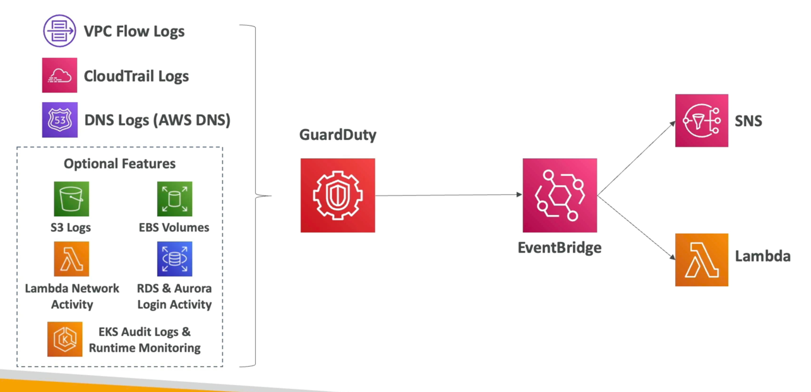

# ガードデューティ

- AWSアカウントを保護するインテリジェントな脅威検出
- 機械学習アルゴリズム、異常検出、サードパーティデータを使用
- ワンクリックで有効（30日間試用）、ソフトウェアをインストールする必要はありません
- 入力データに含まれるもの:
  - CloudTrailイベントログ - 異常なAPL呼び出し、不正な展開。
    - CloudTrail管理イベント - VPCサブネットを作成、トレイルを作成...
    - CloudTrail S3 Data Events - オブジェクトの取得、オブジェクトのリスト、オブジェクトの削除...
  - VPCフローログ - 異常な内部トラフィック、異常なIPアドレス
  - DNS ログ - DNS クエリ内でエンコードされたデータを送信するEC2インスタンスを侵害しました
  - オプション機能 - EKS 監査ログ、RDS & Aurora、EBS、Lambda、S3 Data Events...
- 調査結果の場合に通知するEventBridgeルールを設定できます。
- EventBridgeのルールはAWS LambdaまたはSNSをターゲットにできます
- 暗号通貨攻撃から保護することができます(専用の「発見」があります)
