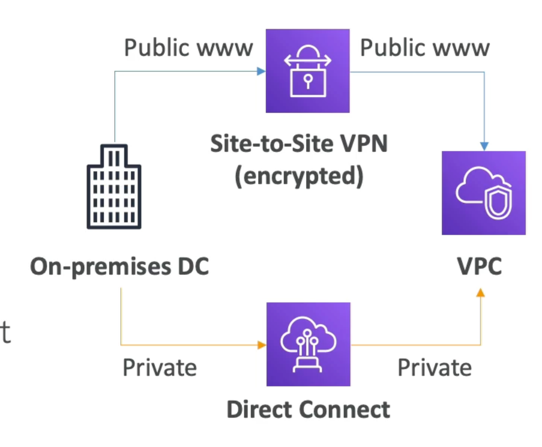
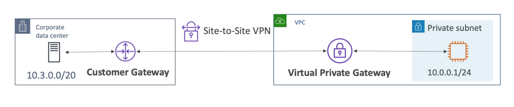
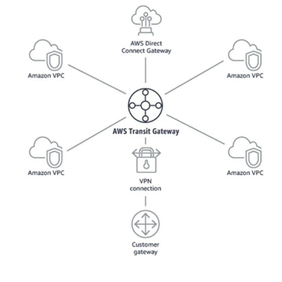

# サイト間VPN対直接接続

## サイト間VPN

- オンプレミス:カスタマーゲートウェイ(CGW)をご利用ください
- AWS: Virtual Private Gateway
  VGW
   を使用する必要があります
- オンプレミスVPNをAWS Public wwwに接続する
- 接続は自動的に暗号化されています
- パブリックインターネットを経由する

## ダイレクト接続

- オンプレミスと AWS 間の物理的な接続を確立する
- 接続はプライベート、安全、高速です
- プライベートネットワークを越えます
- 確立には少なくとも1ヶ月かかります

# Client VPN

- OpenVPNを使用してコンピュータからAWSとオンプレミスのプライベートネットワークに接続します
- プライベート IP 経由で EC2 インスタンスに接続することを許可します（プライベート VPCネットワークにいるかのように）
- パブリックインターネット上へ移動

# トランジットゲートウェイ

- 何千ものVPCとオンプレミスの間で透過的なピアリングを行うために、ハブアンドスポーク(スター)接続
- この機能を提供する単一のゲートウェイ
- 直接接続ゲートウェイ、VPN接続に対応
