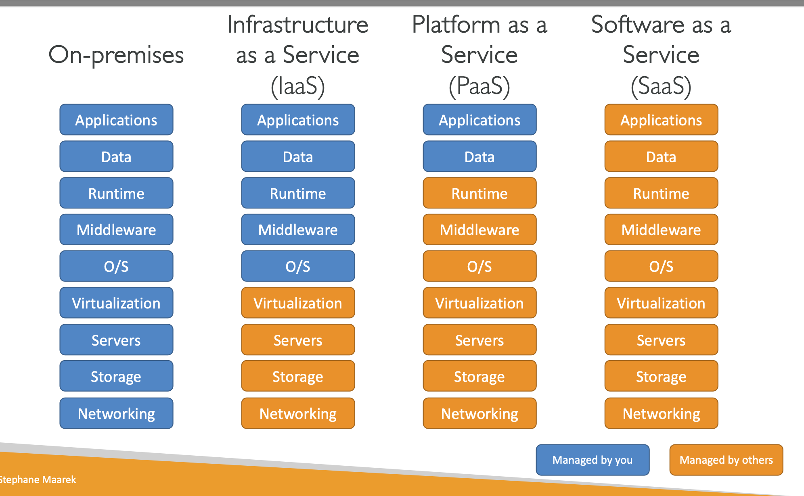

サーバー構成とは何ですか?

- 計算
- メモリ
- ストレージ
- データベース
- ネットワーク

クラウドコンピューティングのタイプ

- サービスとしてのインフラストラクチャ (IaaS)
  例:
  - Amazon EC2
  - GCP, Azure
- サービスとしてのプラットフォーム (Paas)
  例:
  - 弾性ビーンストーク
  - Heroku, Google App Engine, Windows Azure
- サービスとしてのソフトウェア (SaaS)
  例:
  - MLのRekognition
  - Googleマップ、Dropbox ズーム

クラウドの価格

- 計算
  - 計算時間の支払い
- ストレージ
  - クラウド上のデータに対して支払いを行います
- データ転送
  - データ転送は無料です
