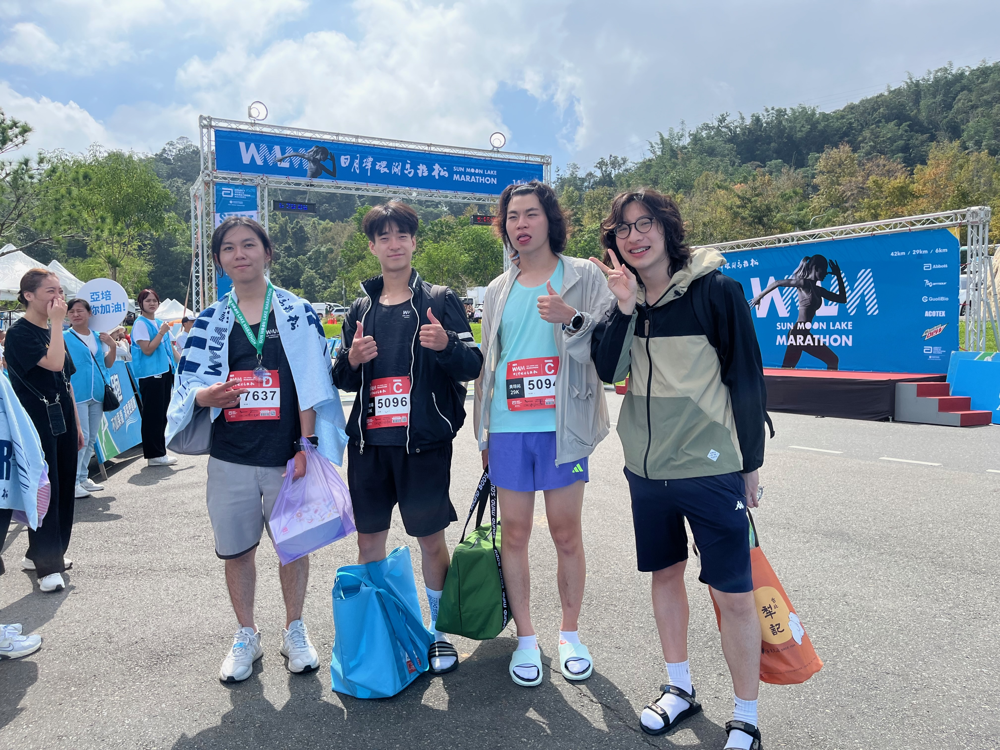

import GPXViewer from '../../../../src/components/ElevationDistanceChart';

<!-- truncate -->

## 路線
<GPXViewer src="/summoonlake.gpx" />

## 心得
這是一次超越自我的挑戰，之前的我都只能跑半馬，為了下次的全馬做準備，決定參加這場超半馬的馬拉松，這場最大的重點我覺得在於對於上下坡的技巧，因為以前也沒有跑過這種類型的馬拉松，在比賽的前半段，對我來說其實並不困難，但我並沒有好好保留體力，反而看到上坡為了維持配速，花了很大的力氣，超過半馬的時候，我的體力大概就用光了，而且小腿也有點抽筋，我只能用走的，完賽成績不盡理想，腳指甲還瘀血，最還還整片掉下來，但整體的體驗還是相當的開心，看到日月潭的風景，自己就覺得很滿足了！

## 完賽成績
- 完賽時間：3:30:00