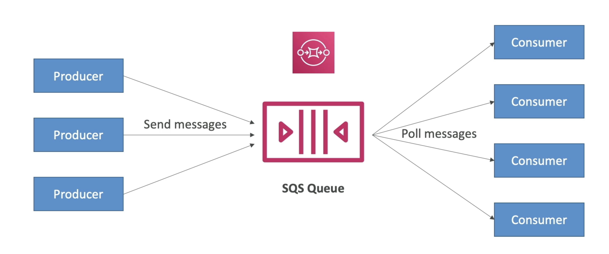
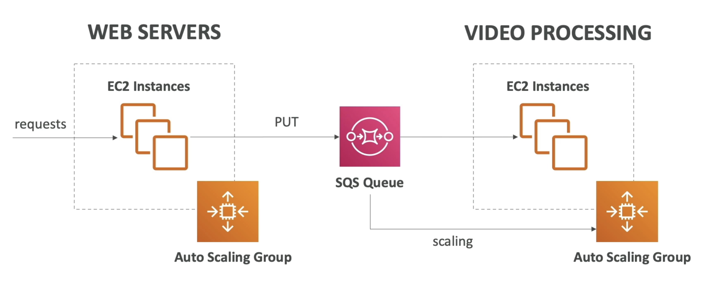
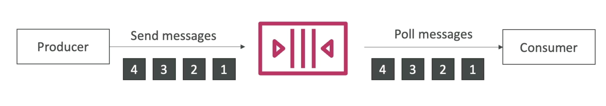

# SQS (队列服务)

- 最老的AWS提供 (10岁以上)
- 完全管理的服务 (~无服务器)，用于解压应用程序
- 从每秒1条消息缩放到每秒10 000 秒。
- 默认保留消息：4天，最多14天
- 对队列中的消息数量没有限制
- 用户阅读消息后会删除消息
- 低延迟(发布和接收时&lt;10 毫秒)
- 消费者共享工作以水平读取信息和缩放

# 拆分应用

# FIFO 队列

