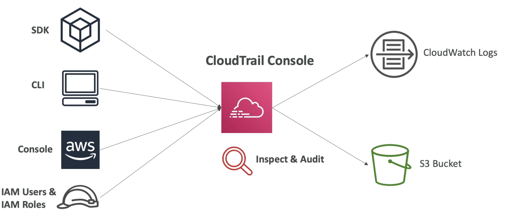

# CloudTrail

- 为您的 AWS 账户提供管理、遵守和审计
- 云跟踪默认启用！
- 通过 AWS 帐户获取事件 / APl 通话的历史记录：
  - 控制台
  - SDK
  - CLI
  - AWS 服务
- 可以将 CloudTrail 的日志放入CloudWatch 日志或 S3
- 轨迹可以应用于所有区域 (默认) 或单个区域。
- 如果一个资源在 AWS 中被删除，请先调查云跟踪！

# 图表

