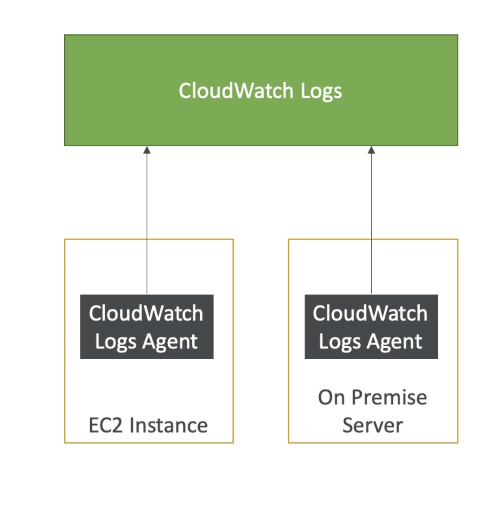

# 云监视日志

- CloudWatch 日志可以从以下来源收集日志：
  - Elastic Beanstalk: 收藏应用程序中的日志
  - ECS：从容器中收集
  - AWS Lambda：从函数日志中收集
  - 基于筛选器的云轨迹
  - CloudWatch 日志代理：在 EC2 机器上或前提服务器上
  - Route53: 日志 DNS 查询
- 启用日志实时监测
- 可调整的云台观察日志保留

# CloudWatch 日志在 EC2

- 默认情况下，您的 EC2 实例中的任何日志都不会转到CloudWatch
- 您需要在 EC2 上运行一个 CloudWatch 代理才能推送您想要的日志文件
- 确保IAM权限正确
- CloudWatch 日志代理也可以在前提下设置
