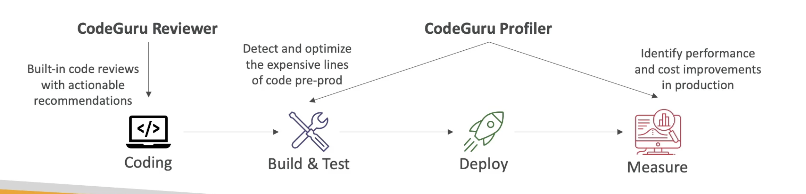

# CodeGuru

- 用于自动化代码审查和应用程序性能建议的 ML驱动服务
- 提供两个功能
- CodeGuru评论员：用于静态代码分析的自动代码评论(开发)
- CodeGuru Profiler: visibility/recommendations about application performance during runtime (production)
  

# CodeGuru 审核者

- 识别关键问题、安全薄弱环节和难以找到的错误
- 示例：通用编码最佳做法、资源泄漏、安全检测、输入验证
- 使用机器学习和自动理由
- 千百万条代码评论上的惨遭吸取的关于开放源码和亚马逊仓库的经验教训
- 支持 Java 和 Python
- 与 GitHub, CodeCommit, Bitbucket 和 AWS CodeBuilding 集成。

# CodeGuru 配置文件

- 帮助理解您应用程序的运行时行为
- 示例：识别您的应用程序是否在日志记录中消耗过大的 CPU 能力
- 功能：
  - 识别和删除代码效率低下的代码
  - 改进应用程序permance(例如降低CPU利用率)
  - 减少计算费用
  - 提供堆摘要标识，使用内存的对象)
  - 异常检测
- 在 AWS 上或在前提上运行的支持应用程序
- 应用程序的最小开销量
