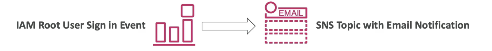
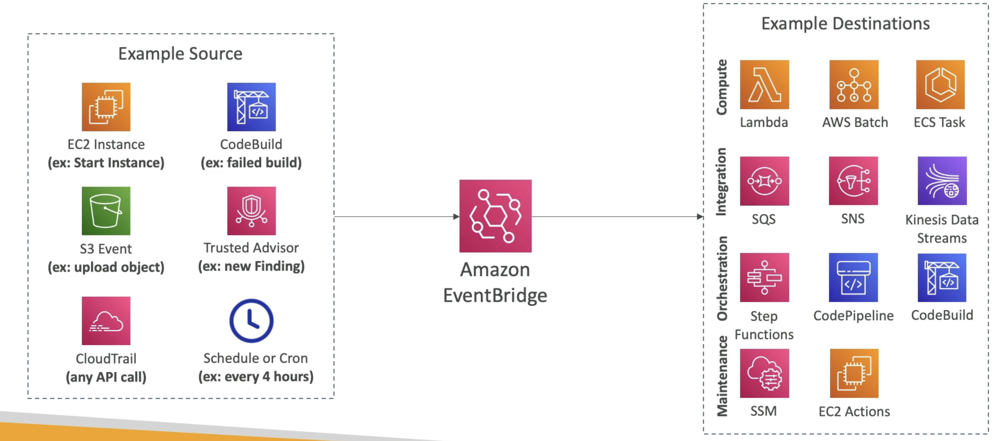
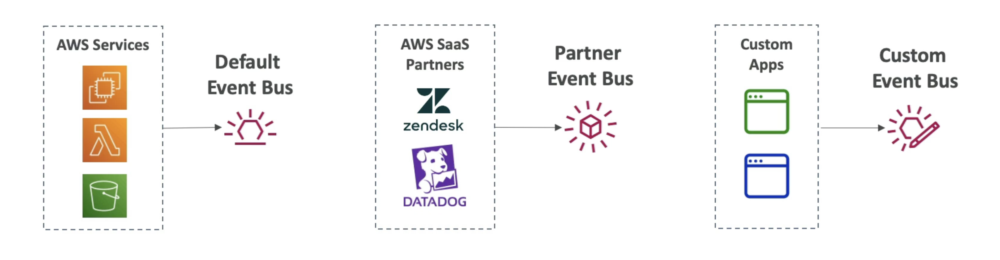

# EventBridge

- Schedule: Cron jobs (scheduled scripts)
  
- Event Pattern: Event rules to react to a service doing something
  
- 触发 Lambda 函数，发送 SQS/SNS 消息...

Example:

----------------------------------

- Schema 注册表：模型事件schema
- 您可以存档发送到事件总线的事件 (all/filter) (无限期或设置周期)
- 重新播放存档事件的能力
