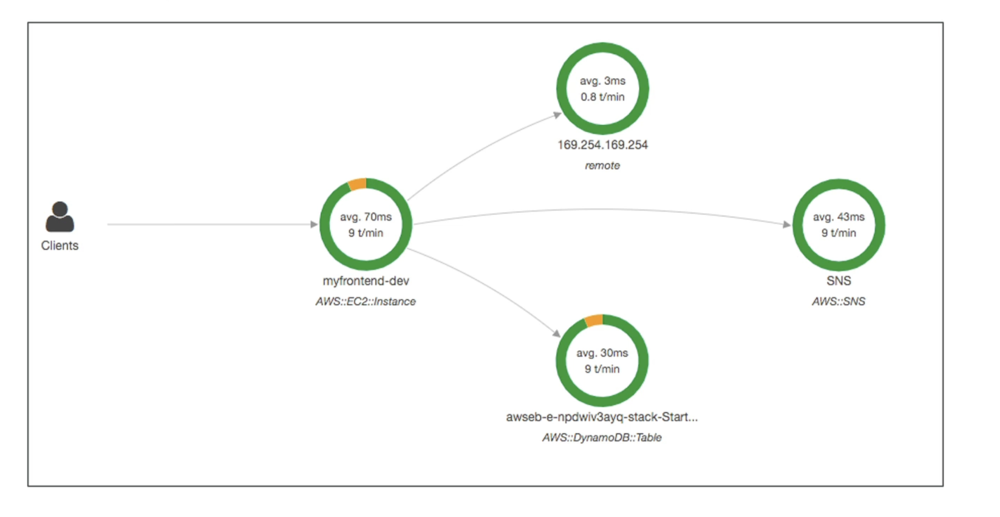

# X光线

- 生产中的调试，旧的方式：
  - 本地测试
  - 随时随地添加日志语句
  - 生产中的重新部署
- 不同应用程序的日志格式不同，日志分析也很困难。
- 调试：一个大单人"轻松"，分配服务"硬"
- 您的整个架构没有常见的视图

## 示例：

# 优势

- 故障排除性能(瓶颈)
- 了解微型服务架构中的依赖关系
- Pinpoint 服务问题
- 审核请求行为
- 查找错误和异常
- 我们是否有时间开会？
- 我在哪里去了？
- 识别受影响的用户
