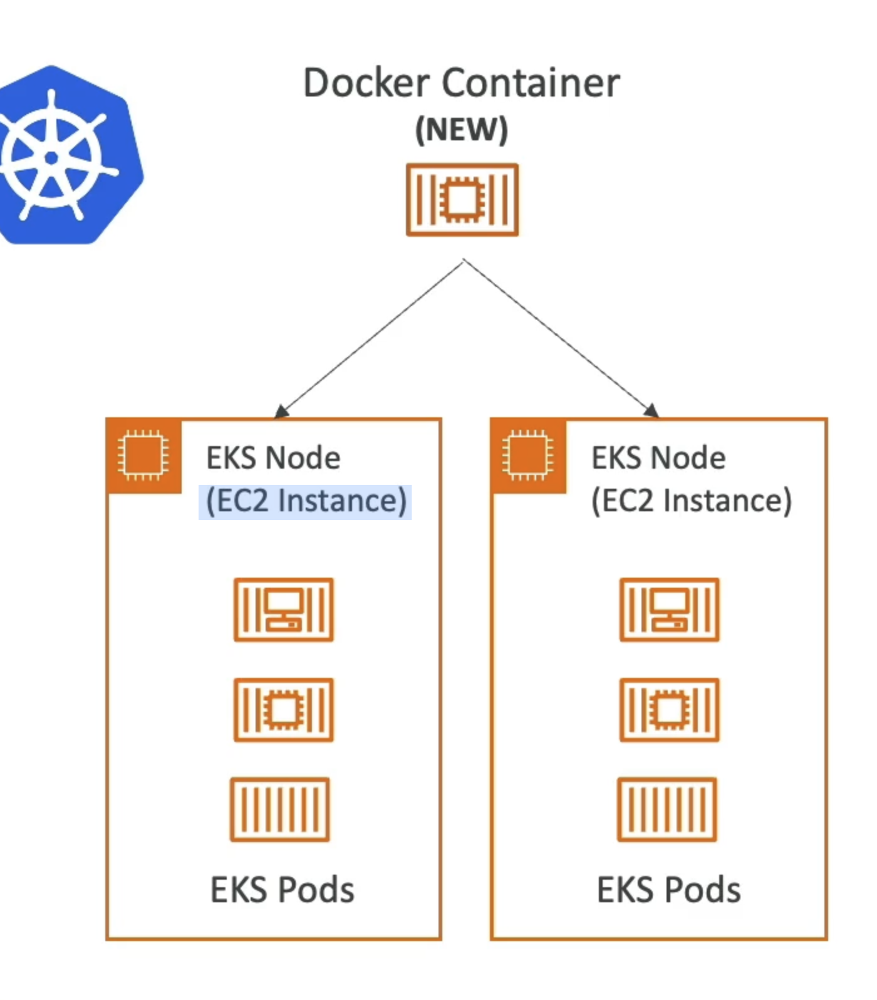

# ECS (激光容器服务)

- ECS = 弹性容器服务
- 在 AWS 上启动 Docker 容器
- 您必须提供并维护基础结构(EC2实例)
- AWS 负责启动/停止容器
- 与应用程序负载均衡的集成。

# Fargate

- 在 AWS 上启动 Docker 容器
- 您没有提供基础结构 (没有要管理的 EC2 实例) - 更简单！
- 无服务提供
- AWS 仅根据您所需的 CPU / RAM 为您运行容器

# ECR (激光容器注册)

- 弹性容器注册表
- AWS 上的私有Docker 注册表
- 这是您存储Docker图像的地方，所以它们可以由 ECS 或 Fargate 运行

# EKS (Elastic Kubernetes Service)

- EKS = Elastic Kubernetes Service
- 允许您启动已管理的 Kubernetes 集群在 AWS
- Kubernetes是一个用于管理、部署和缩放容器应用(Docker)的开源系统
- 容器可以托管于：
- EC2 实例
- 花门(无)
- Kubernetes 是云雾化的
  (可用于任何云端的 - Azure, GPC...)
