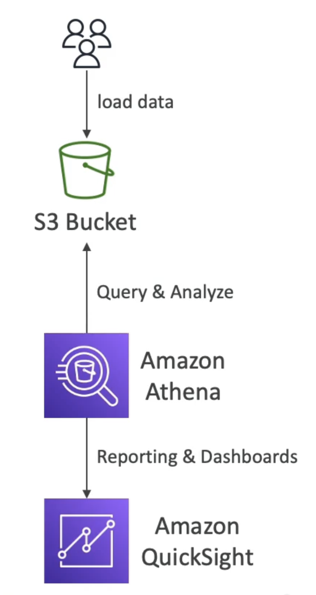

# Amazon Athena

- 针对S3对象进行分析的无服务器查询服务
- 使用标准的 SQL 语言查询文件
- 支持 CSV、JSON、OCRC、Avro和Parquet (建立在Presto上)
- 定价：每TB扫描数据5.00美元
- 使用压缩或列数据节约成本(减去扫描)
- 使用案例：商业情报/分析/报告、分析和查询 VPC流程日志、ELB 日志、CloudTrail 轨迹等...
- 考试提示：使用 serverless SQL 分析在 S3 中的数据，请使用 Athena
