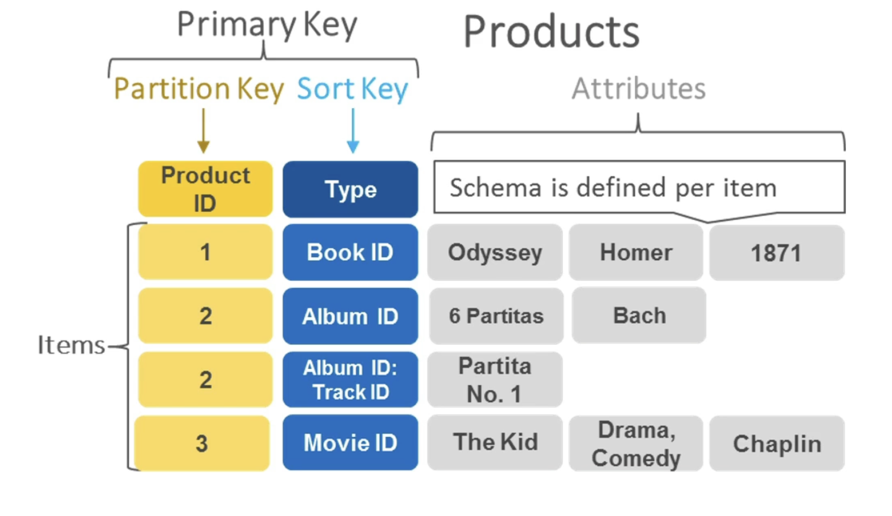
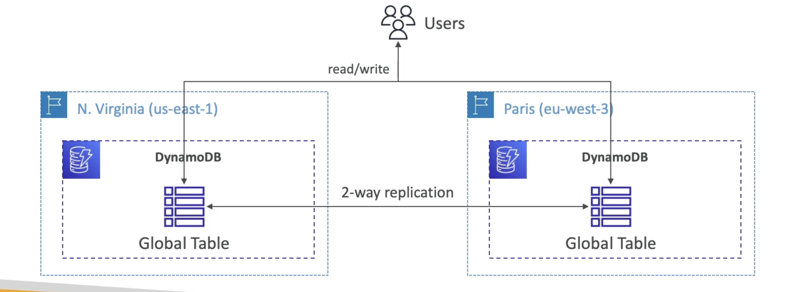

# 概览

- 高质量管理并复制到3个AZ区域
- NoSQL 数据库 - 不是关系数据库
- 缩放到大量工作量，分布“无服务器”数据库
- 每秒数以百万计的要求、数万列、100吨储存量
- 快速和一贯的业绩
- 单位数毫秒延迟-低延迟检索率
- 为安全、授权和管理而与内部行政管理机制整合
- 低成本和自动缩放能力
- 标准和不经常访问 (IA) 表 类

# 动态DB 数据类型

- DynamoDB is a key/value database
  

# DynamoDB Accelerator - DAX

!(DynamoDB-Accelerator)[./DynamoDB-Accelerator.png]

- DynamoDB 完全管理内存缓存
- 10x 性能改进 - 当访问您的 DynamoDB 表时，单位毫秒延迟到微秒延迟
- 安全性、高度可扩展性和高度可用
- CCP 层面与 ElastiCache 的差异：DAX 仅用于动态数据库并与动态数据库集成，而ElastiCache 可以用于其他数据库

# 动态数据库全局表

- 让一个低延迟的动态数据库表可以在多个区域访问
- 活动复制(读取/写入任何AWS区域)
