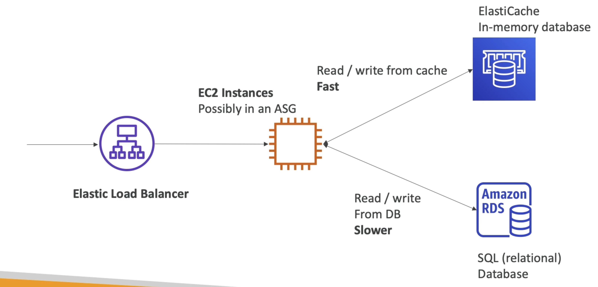

# 概览

RDS获得管理的关系数据库的同样方式...
• ElastiCache is to get managed Redis or Memcached
• Caches are in-memory databases with high performance, low latency
• Helps reduce load off databases for read intensive workloads
• AWS takes care of OS maintenance / patching, optimizations, setup, configuration, monitoring, failure recovery and backups
