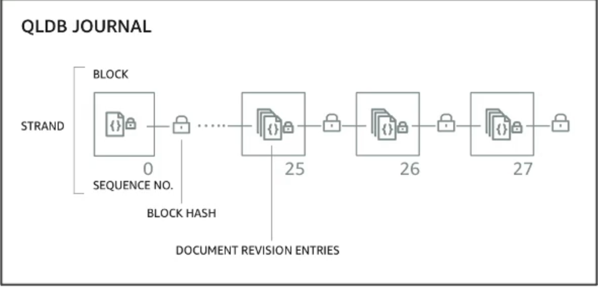

# QLDB (Quantum Ledger 数据库)

- QLDB 表示"量级Ledger Database"
- 分类账是一本记录金融交易的书
- 完全管理、 无服务、 高可用、 通过 3 AZ 复制的
- 用于查看对您的应用程序数据随着时间的推移所作的所有更改的历史记录
- 不可变系统：无法删除或修改任何条目，可加密验证
- 2-3x 性能优于普通分类账区块链框架，使用 SQL 操作数据
- 与亚马逊管理区块链的差价：没有按照财务条例规则下放权力
