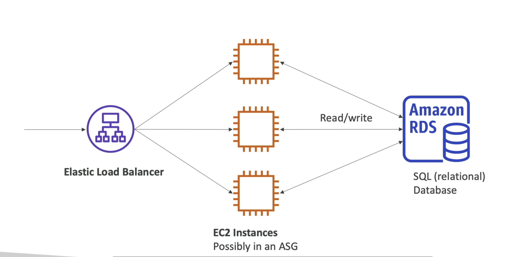
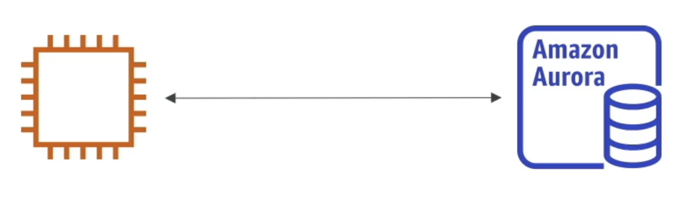
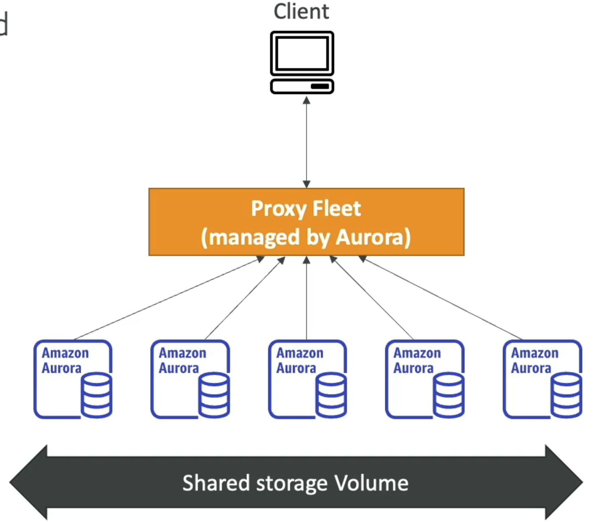
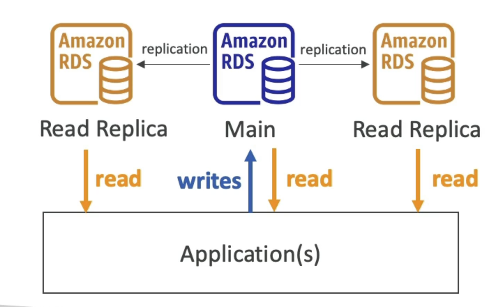
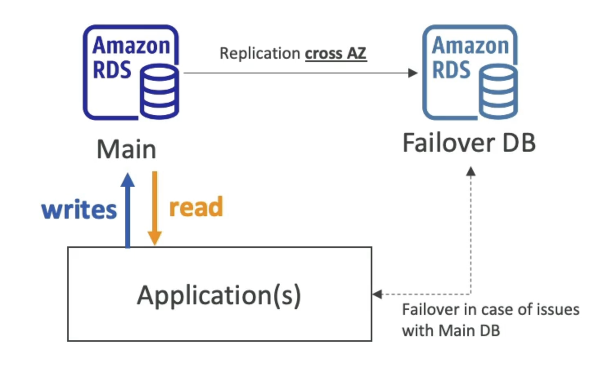
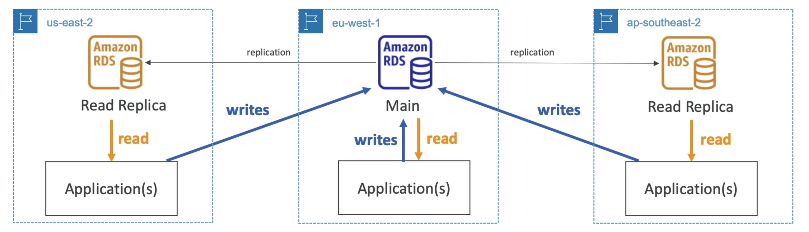

# 一. 导言

• RDS表示关系数据库服务
• 它是一个管理数据库服务的DB服务，使用SQL作为查询语言。
• 它允许您在云端创建由AWS
• Postgres
• MySQL
• MariaDB
• Oracle
• Microsoft SQL Server
• IBM DB2
• Aurora (AWS 所有权数据库)

# 福利

• RDS is a managed service:
• Automated provisioning, OS patching
• Continuous backups and restore to specific timestamp (Point in Time Restore)!
• Monitoring dashboards
• Read replicas for improved read performance
• Multi AZ setup for DR (Disaster Recovery)
• Maintenance windows for upgrades
• Scaling capability (vertical and horizontal)
• Storage backed by EBS
• BUT you can't SSH into your instances

# Amazon Aurora

• Aurora is a proprietary technology from AWS (not open sourced)
• PostgreSQL and MySQL are both supported as Aurora DB
• Aurora is "AWS cloud optimized" and claims 5x performance improvement over MySQL on RDS, over 3x the performance of Postgres on RDS
• Aurora storage automatically grows in increments of IOGB, up to 128 TB
• Aurora costs more than RDS (20% more) - but is more efficient
• Not in the free tier

# Amazon Aurora Serverless

• Automated database instantiation and auto-scaling based on actual usage
• PostgreSQL and MySQL are both supported as Aurora Serverless DB
• No capacity planning needed
• Least management overhead
• Pay per second, can be more cost-effective
• Use cases: good for infrequent, intermittent or unpredictable workloads...

# RDS部署

## RDS 读取Replicas

• Scale the read workload of your DB
• Can create up to 15 Read Replicas
• Data is only written to the main DB

## RDS 多AZ (灾后恢复)

- • 数据只读/写入主数据库
  • 作为故障，只能有另外一个AZ

## 多区域(读取重复测定)

• Disaster recovery in case of region issue
• Local performance for global reads
• Replication cost
