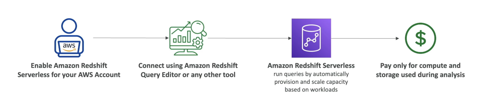

# 概览

- Redshift是基于 PostgreSQL 的，但它没有用于OLTP
- OLAP - 在线分析处理(分析和数据存储)
- 每小时加载一次数据，而不是每秒一次
- 10x 性能优于其他数据仓库的性能，将数据缩放到PBC
- 列存储数据 (而不是基于行)
- 大量并联查询执行 (MPP)，高度可用
- 根据预置的实例进行支付
- 有用于执行查询的 SQL 接口
- BI工具，如AWS Quicksight或Tableau集成工具

# Redshift 服务器

- 自动提供和缩放数据仓底能力
- 运行分析工作负载而不管理数据仓基础设施
- 只为您使用的东西支付 (保存成本)
- 使用案例︰ 报告、仪表上的应用程序、 实时分析...
