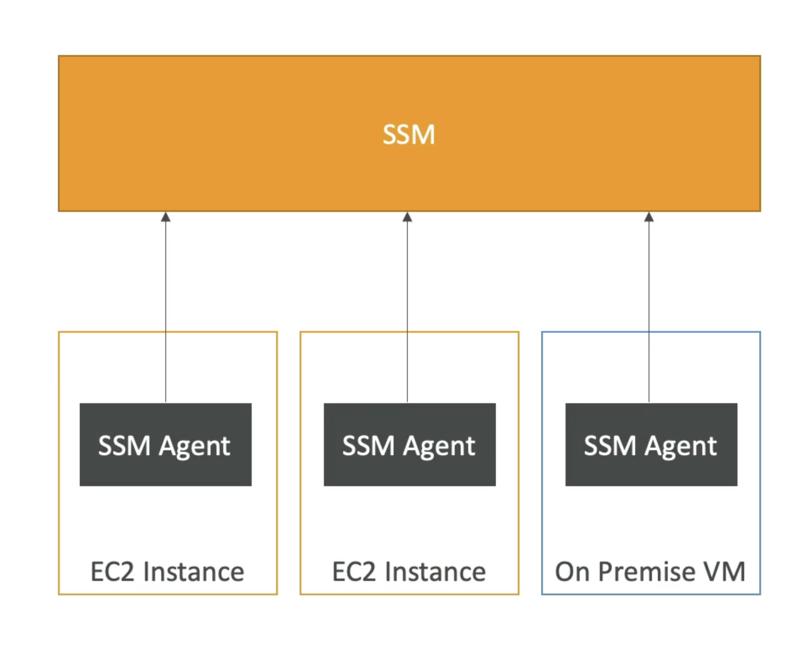
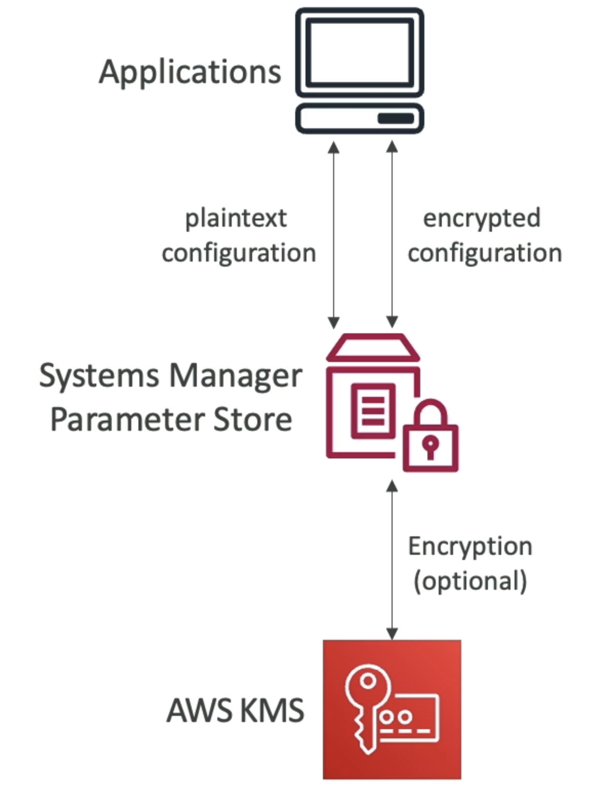

# SSM

- 帮助您按比例管理您的 EC2 和 On-Buildes 系统
- 另一个混合AWS服务
- 获取关于您基础设施状态的操作信息
- 10+产品套装
- 最重要的特点是：
  - 改进遵守情况的修理自动化
  - 在整个服务器队运行命令
  - 使用 SSM 参数商店保存参数配置
- 用于 Linux, Windows, MacOS, and Raspberry Pi OS (Raspbian)

# 它的工作方式

- 我们需要将SSM代理安装到我们控制的系统
- 默认在Amazon Linux AMl 和一些Ubuntu AMI 上安装
- 如果一个实例不能通过 SSM 控制, 它'. 可能是与SSM代理人的一个问题。
- 感谢SSM代理，我们可以运行命令，修补和配置我们的服务器

# SSM 会话管理器

- 允许您在您的 EC2 和前提服务器上启动一个安全的 shell
- 不需要 SSH 访问权限、基础主机或 SSH 密钥
- 无需端口 22 (更好的安全性)
- 支持 Linux、macOS 和 Windows
- 发送会话日志数据到 S3 或 CloudWatch 日志

# 系统管理器参数存储

- 配置和秘密安全存储
- API 密钥，密码，配置...
- 无服务器，可缩放，耐久，简单的 SDK
- 使用 IAM 控制访问权限
- 版本跟踪和加密 (可选)
