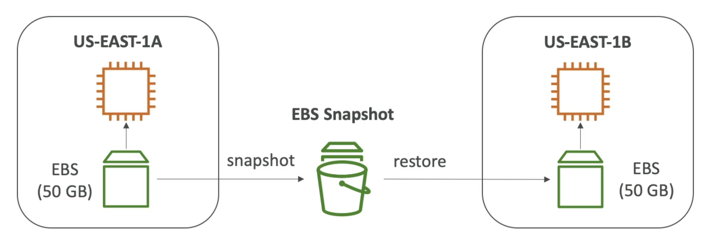

# EBS简介

- EBS (Elastic Block Store)音量是一个网络驱动器，在运行实例时您可以附加到您的实例
- 它允许您的实例持续数据，即使在它们终止后
- 每次只能挂载一次（在CCP级）
- 它们被绑定到一个特定的可用区
- Analogy:将它们视为“网络 USB 棒”
- 免费等级： 30 GB 免费的普通类或磁力的 EBS 存储 (SSD)

# EBS Snapshots

- 在一个时间点创建您的 EBS 音量的备份 (快照)
- 无需分离音量进行快照，但推荐使用
- 可以将快照复制到 AZ 或区域
  

## EBS 快照存档

- 移动快照到更便宜的 "归档层"
- 在24小时至72小时内恢复存档

## 用于EBS快照的回收站

- 设置规则以保留已删除的快照，以便您能够在意外删除后恢复
- 指定保留时间(从 | 天 到 | 年份)
