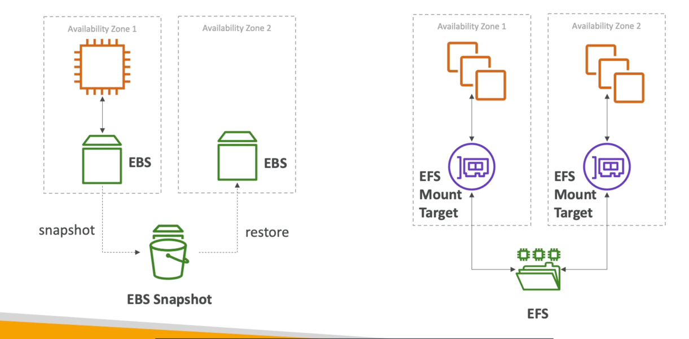
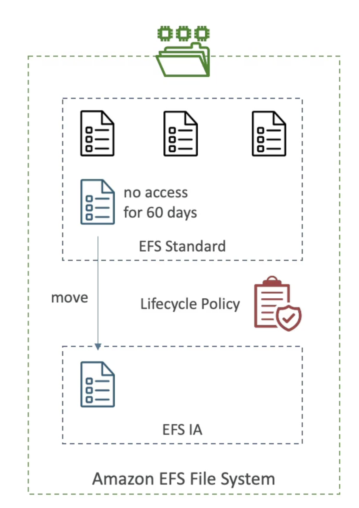

- 管理 NFS (网络文件系统)，可以挂载在 EC2 的100s上
- EFS 与 Linux EC2 实例在多AZ
- 高度可用、可缩放、昂贵(3x gp2)、每次使用付费, 没有能力计划
  ！[EFS](./EFS.png)

## EFS 对 EBS

## EFS-IA(不经常访问)

- 没有每天访问文件的成本优化存储类
- 与EFS标准相比，成本低至92%
- EFS 会根据上次访问时您的文件自动移动到EFS-IA
- 启用生命周期政策 EFS-IA
- 示例：将60天内未访问的文件移动到EFS-IA
- Transparent to the applications accessing EFS
  
