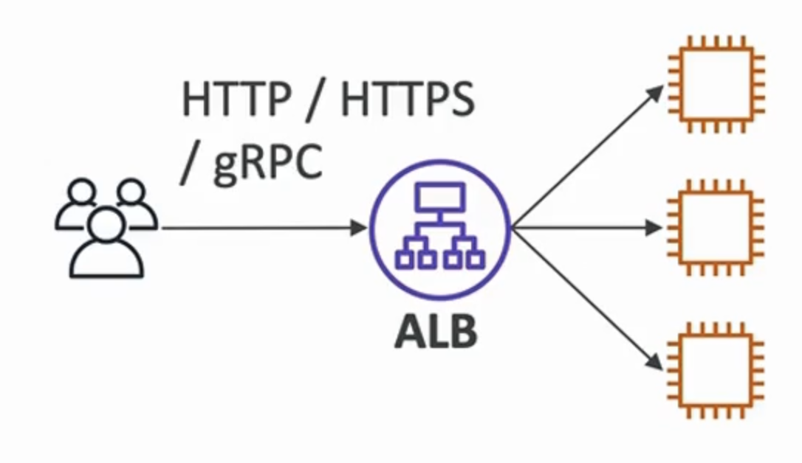
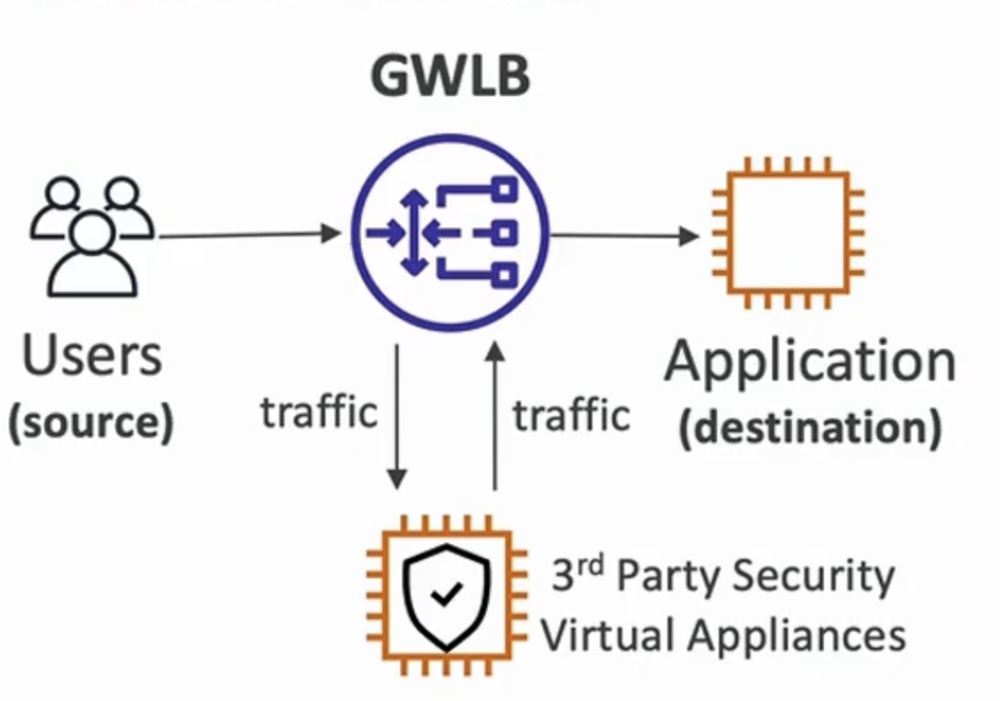

# 弹性负载均衡介绍

- 在多个下游实例中传播负载
- 向您的应用程序显示单个访问点 (DNS)
- 无缝处理下游实例失败
- 定期检查您的实例
- 为您的网站提供 SSL 终止 (HTTPS)
- 高可用度
- ELB (持久负载均衡) 是一个管理负载均衡器
- AWS 保证它将正常工作
- AWS 负责升级、维护、高可用度
- AWS 只提供几个配置套装
- 设置您自己的负载平衡器所需的费用较低，但在您的末尾将会做更多的努力(维护、集成)

# AWS提供的4种负载平衡器：

- 应用程序负载均衡器 (HTTP / HTTPS 唯一) - 图层 7
- 网络负载均衡器 (超高性能, 允许TCP) - 图层 4
- 网关负载均衡器 - 3层
- 经典负载均衡器 (2023年退休) - 第四层 & 7

# 应用程序负载均衡器 (ALB)

- assistance/ HTTPS / gRPC 协议 (Layer 7)
- 导入路由功能
- Static DNS (URL)
  

# 网络负载均衡(NLB)

- TCP / UDP 协议 (Layer 4)
- 性能高：每秒内请求数以百万计的
- Static IP through Elastic IP
  

# 网关负载均衡器 (GWLB)

- GENEVE 协议关于IP包 (Layer 3)
- 路由流量到您在 EC2 实例上管理的防火墙
- 入侵检测
  
