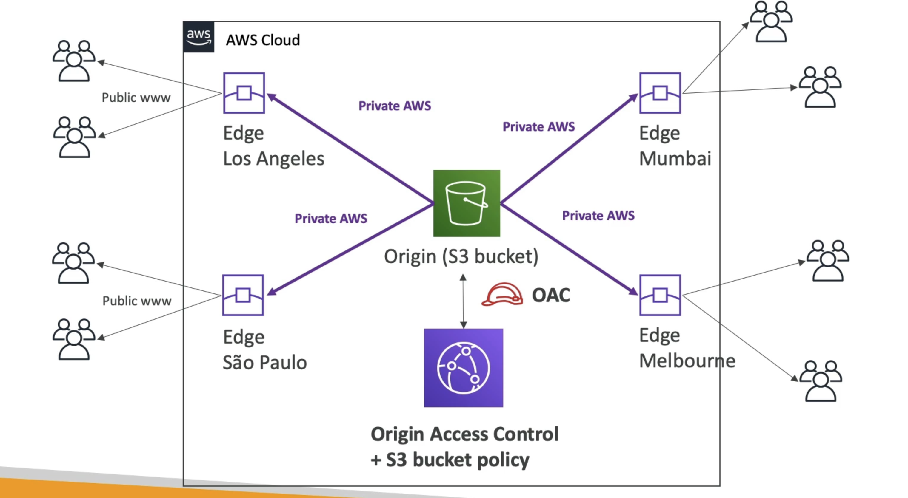

# 云前台概述

- 内容发送网络 (CDN)
- 改进读取性能，内容缓存在边缘上
- 改善用户体验
- 216 全局存在点 (边缘位置)
- DDoS 保护 (因为世界范围)，与 Shield, AWS Web 应用程序防火墙

# 来源

## S3 桶数

- 用于分发文件并缓存到边缘
- 使用 CloudFront 源访问控制 (OAC) 加强安全
- OAC 正在替换原始访问身份(OAl)
- CloudFront 可以用作导入器 (将文件上传到 S3)

## 自定义来源 (HTTP)

- 应用程序负载均衡器
- EC2 instance
- S3网站 (必须首先启用将桶作为静态S3网站)
- 任何您想要的 HTTP 后端

# 云端高级

- Example:
  

# 云端与S3交叉区域复制操作

## 云端前台：

- 全局边缘网络
- TTL文件已缓存(可能是一天)
- 非常适合静态内容，必须随时随地可用

## S3 跨区域复制：

- 必须为您想要复制的每个区域设置
- 文件在近实时更新
- 只读
- 极好的动态内容需要在低延迟状态下才能使用
