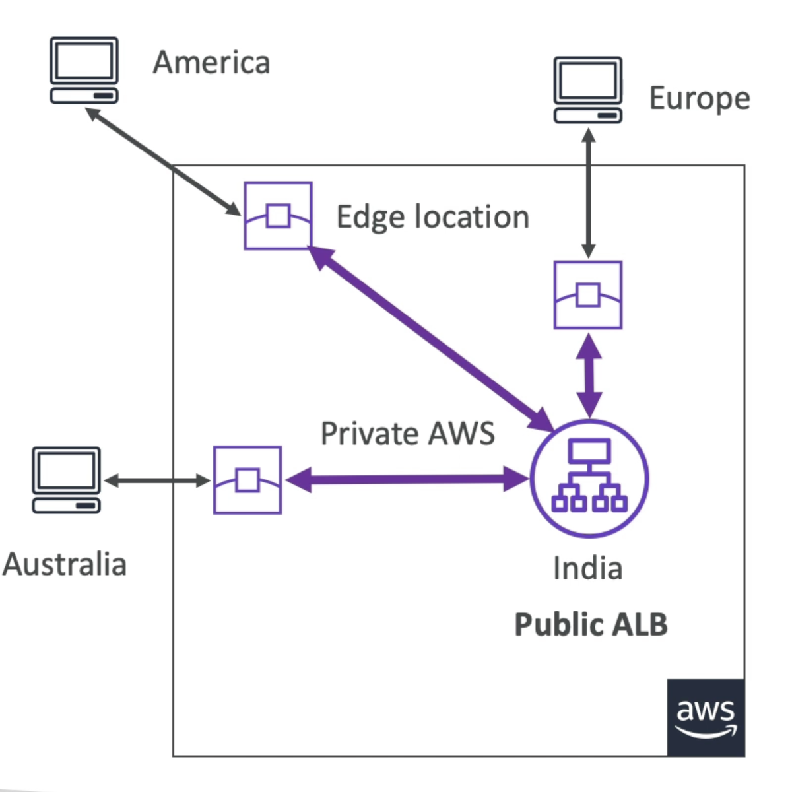

# 全局加速器

- 利用AWS全球网络提高全球应用程序的可用性和性能。
- 利用AWS内部网络优化您应用程序的路径 (60% 改进)
- 2 AnycastIP是为您的应用程序创建的，流量通过边缘位置发送
- 边缘位置发送流量到您的应用程序

# 图表

# 全局加速器对云台

- 它们都使用AWS全球网络及其在世界各地的边缘位置
- 这两种服务都与AWS Shield相结合以保护DDoS。
- CloudFront - 内容发送网络
  - 提高您可缓存内容的性能(例如图像和视频)
  - 内容在边缘服务
- 全局加速器
  - 在一个或多个AWS区域运行的应用程序边缘没有缓存、代理数据包。
  - 通过 TCP 或 UDP 提高广泛应用的性能。
  - 适合使用 HTTP 大小写需要静态IP地址
  - 适合使用 HTTP 的案例需要确定性的、快速的区域故障。
