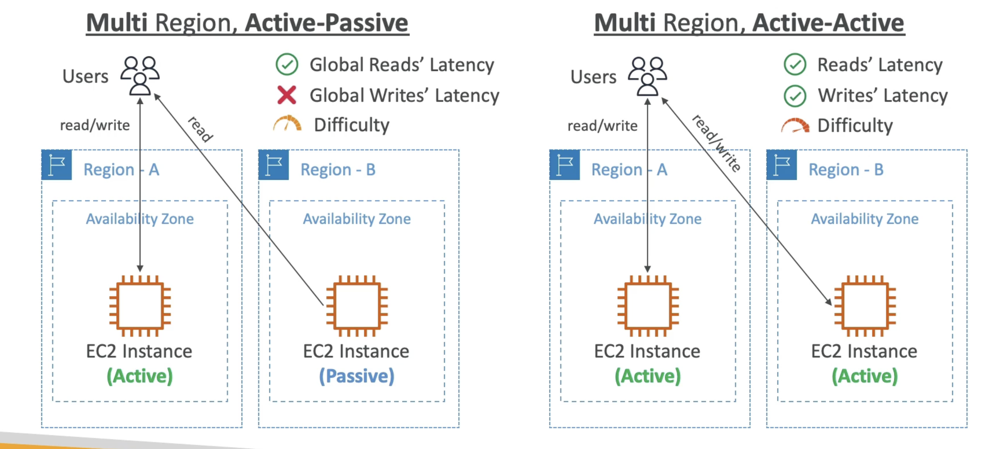

# 本地区域

- 将AWS的计算、存储、数据库和其他选定的AWS服务放在靠近终端用户的位置以运行延迟敏感的应用程序
- 将您的 VPC 扩展到更多位置 -
  "扩展AWS 区域"
- 兼容 EC2, RDS, ECS, EBS, ElastiCache, Direct Connect ...
- 示例：
- AWS Region: N. Virginia (us-east-I)
- AWS Local Zones: Boston, Chicago, Dallas, Houston, Miami, etc.

# 全局应用程序结构

