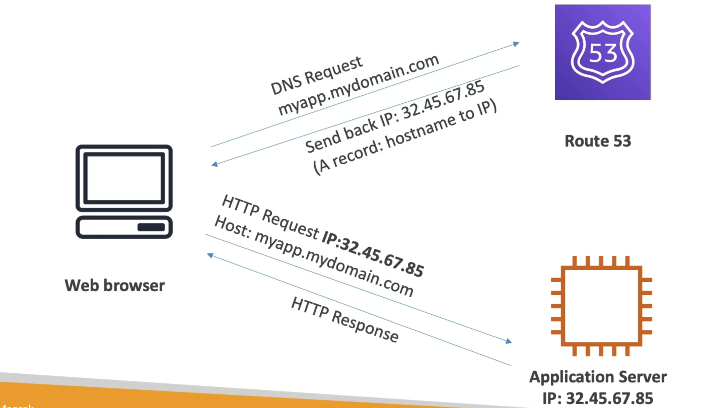
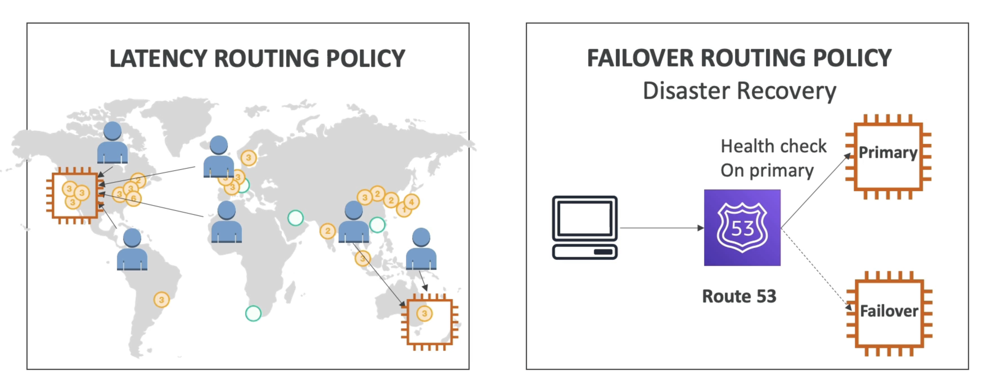

# 概览

- 路由53 是一个被管理的DNS(命名系统)
- DNS是一个规则和记录集，帮助客户端了解如何通过URL到达服务器。
- AWS最常见的记录是：
- www.google.com => 12.34.56.78 == 记录(IPV4)
- www.google.com => 2001:0db8:85a3:00:00:0000:00:8a2e:0370:7334 == AAAA IPv6
- search.google.com => www.google.com == CNAME: 主机名
- example.com => AWS resource == 别名 (例如: ELB, CloudFront, S3, RDS等...)

# 图表

# 路由策略

