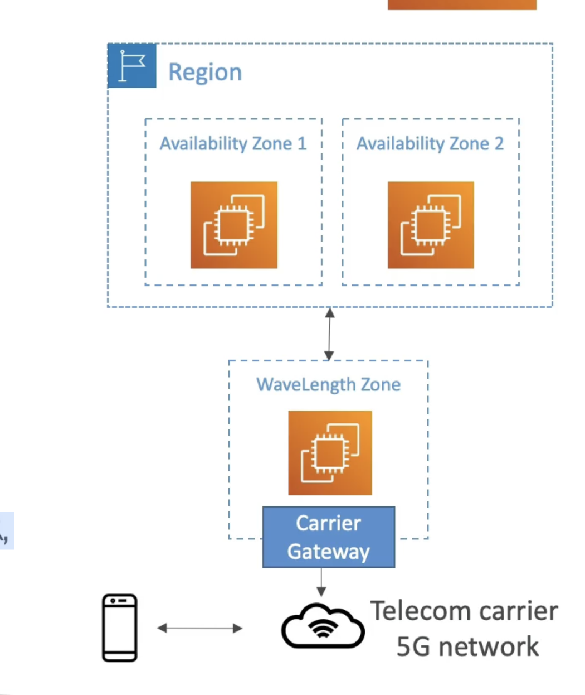

# 波长度

- WaveLength Zones 是位于SG网络边缘的电信供应商基准中心内的基础设施部署
- 将AWS服务带到5G网络的边缘
- 例如: EC2, EBS, VPC...
- 通过5G网络超低延迟应用程序
- 流量不离开通信服务提供商(CSP)网络
- 高带宽和安全连接到父AWS区域
- 没有额外费用或服务协定
- 使用实例：智能城市，ML辅助诊断，连接车辆，交互式现场视频流，AR/VR，实时游戏...
