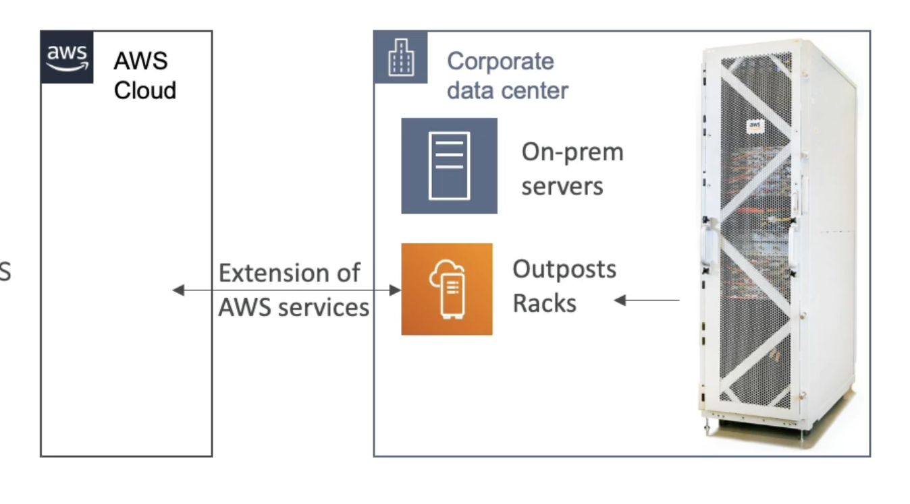

# 前端

- 混合云：企业与云端基础设施并存的办公场地基础设施
- 因此，处理信息技术系统的两种方式：
- AWS 云端一个(使用 AWS 控制台、CLI 和 AWS APls)
- 一个用于他们在房地上的基础设施
- AWS 前台是提供相同的 AWS 基础设施、服务的“服务器机架”。 就像在云端一样，在前提上构建您自己的应用程序的APls & 工具
- AWS 将在您所在的场地内设置和管理"前哨机架"，您可以在场地上开始利用AWS服务
- 你负责前哨机架的物理安全

# 福利

- 房地内系统的低延迟访问
- 本地数据处理
- 数据居住性
- 更容易从房间迁移到云端
- 完全管理服务

# 一些在前台工作的AWS服务

- EC2
- EBS
- RDS
- ECS
- S3
- EKS
- EMR
