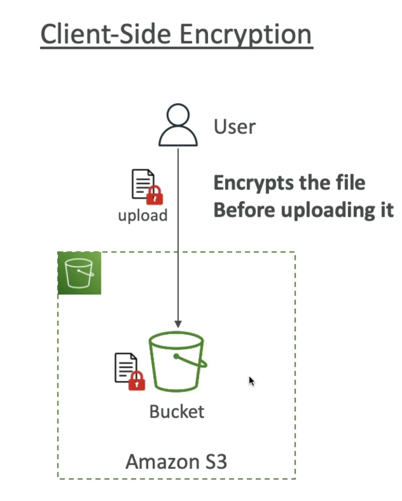

# 使用大小写

- 备份和存储
- 灾后恢复
- 存档
- 混合云存储
- 应用程序主机
- 媒体主机
- 数据湖与大数据分析
- 软件交付
- 静态网站

# 桶数

- Amazon S3允许人们在“buckets”(目录)中存储对象 (文件)
- 圆桶必须有全局唯一的名称 (在所有区域所有帐户)
- 圆桶定义在区域一级
- S3看起来像一个全局服务，但是bucets是在一个区域创建的

# 对象

- 对象(文件) 有一个密钥
- 密钥是完整的路径：
  - s3://my-bucket/my_file.txt
  - s3://my-bucket/my_folderl/another_folder/my_file.txt
- 密钥由前缀 + 对象名称
  - s3://my-bucket/my_folder|/another_folder/my_file.txt
- bucket中没有“目录”概念(尽管Ul 会让你思考其他问题)

## 包含

- 对象值是物体的内容：
- 最大值 对象大小为 5TB (5000GB)
- 如果上传超过 5GB，必须使用“多部分上传”
- 元数据(文本键/值对列表 - 系统或用户元数据)
- 标签 (Unicode key / 值对 - 最多10) - 对安全/生命周期有用。
- 版本 ID (如果启用版本控制)

# 安全

## 以用户

- IAM策略 - 应该允许来自IAM的特定用户 API 调用

## 基于资源

- 桶策略 - 来自 S3 控制台的 bucket 宽度规则 - 允许交叉账户
- 对象访问控制列表 (ACL) - 更精细的谷物(可以禁用)
- 桶存取控制列表 (ACL) - 不太常见(可以禁用)

## 注意：IAM主体可以访问S3对象

- 用户IAM权限允许或者资源策略允许它
- 并且没有明确的结束时间

## 加密：使用加密密钥在Amazon S3中加密对象

# S3 桶策略

- 基于JSON的政策
  - 资源：桶和对象
  - 效果：允许 / 拒绝
  - 动作：允许或拒绝 APl
  - 主体：账户或用户应用此政策
- 使用S3桶策略：
  - 授予公共访问bucket
  - 强制上传对象进行加密
  - 允许访问另一个帐户 (Cross Account)

# S3 静态网站

- 您需要公开所有buket才能访问网站。

# S3 Versioning

- 您可以在 Amazon S3 版本您的文件
- 它已在桶中启用
- 相同的密钥覆盖将更改"版本"：1，2，3......
- 最佳做法是版本您的bucket
- 保护免受意外删除(恢复版本的能力)
- 轻松回滚到以前的版本

## 注：

- 任何在启用版本控制之前没有版本化的文件将有版本“null”
- 暂停版本不删除以前的版本
  ！[S3 版本控制](Versioning.png)

# S3 复制(CRR & SRR)

- 必须在源和目标桶中启用版本控制
- 跨区域复制(CRR)
- 同一区域复制(SRR)
- 桶可以在不同的 AWS 帐户中
- 复制是异步的
- 必须给予S3异步复制适当的 IAM 权限
- 使用案例：
- CRR - 合规, 较低的延迟访问, 在帐户间复制
- SRR - 日志聚合，生产与测试之间的现场复制工作

# S3 存储类

## Amazon S3 标准 - 一般目的

- 99.99% 可用性
- 用于经常访问的数据
- 低延迟度和高通量
- 维持2个并行的设施故障
- 使用案例：大数据分析、移动和游戏应用、内容发布...

---

- 对于访问频率较低但需要快速访问的数据
- 低于S3标准的成本

## Amazon S3 标准不频繁访问 (IA)

- 99.9% 可用性
- 使用案例：灾后恢复、备份

## Amazon S3 一种不经常访问

- 单一AZ耐久性高(99.999999999%)；AZ被摧毁时数据丢失
- 99.5% 可用性

---

- 用于存档/备份的低成本对象存储
- 定价：存储价格 + 对象检索成本

## Amazon S3 冰川即时获取

- 千米秒检索，每季度访问一次数据极棒。
- 最小存储持续时间90天

## Amazon S3 冰川灵活获取

- 快速(我到5分钟)，标准(3到5小时)，散装(5到12小时)-免费
- 最小存储持续时间90天

## Amazon S3 冰川深度存档

- 标准(12小时)，散装(48小时)
- 最小存储时间为180天

---

## Amazon S3 智能Tiering

- 小额月度监控和自动加价费

- 根据使用情况在访问层之间自动移动对象

- S3 Intelligent-Tiering 中没有检索费用

- 常用访问级别 (自动)：默认级别

- 频繁访问级别(自动)：30天内无法访问对象

- 存档即时访问级别(自动)：90天内无法访问对象

- 存档访问级别(可选)：可配置的 90 天至 700+ 天

- 深入存档访问级别(可选)：配置。 从180天到700多天

- 可以手动移动类或使用 S3 生命周期配置

# 耐久性和可用性

## 耐久度：

- 穿过多个AZ的物体的耐久性很高(99.9999999%，1 | 9's)
- 如果您用Amazon S3存储10,000,000个对象，您平均可以预期每10 000年丢失一个对象
- 所有存储类相同

## 可用性：

- 衡量服务是否随时可用。
- 取决于存储类别的差数
- 例如：S3标准有99.99%的可用性=不能每年提供53分钟

# 加密

## 服务器端加密

## 客户端加密

# SIM 卡访问分析器 S3

- 确保只有预定的人可以访问您的S3桶。
- 示例：可公开访问的 bucket，bucket 与其他 AWS 帐户共享...
- 评估S3桶政策，S3ACL，S3接入点政策
- 由 IAM 访问分析器提供支持

# 分享S3责任模型

## AWS 责任：

- 基础设施(全球安全、耐久性、可用性、维持两个设施同时损失的数据)
- 配置和脆弱性分析
- 合规验证

## 客户责任：

- S3 Versioning
- S3 桶策略
- S3 复制设置
- 日志记录和监测
- S3 存储类
- 休息和过境数据加密
