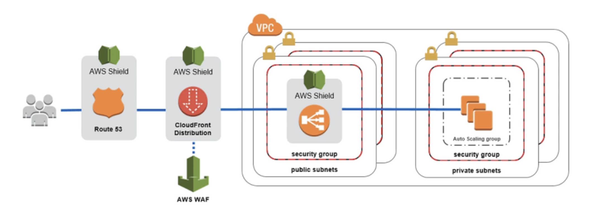

# DDoS 保护 (分布式拒绝服务) AWS

- AWS Shield Standard：为您的网站和应用程序保护所有客户免受DDOS 的攻击，无需额外费用
- 高级AWS 盾牌： 24/7 高级DDoS 保护
- AWS WAF：基于规则筛选特定请求
- 云前沿和路由 53：
  - 使用全局边缘网络进行可用性保护
  - 与AWS Shield结合在一起，在边缘提供攻击缓冲
- 随时准备缩放 - 自动调整AWS

# 盾牌

## AWS 护盾标准：

- 为每个AWS客户激活的免费服务
- 提供保护，免受攻击，如SYN/UDP水流、反射攻击和其他3层4级攻击。

## AWS 盾牌高级：

- 可选DDoS缓解服务(每个组织每月3 000美元)
- 保护亚马逊EC2、弹性负载均衡(ELB)、亚马逊云阵线、AWS全球加速器以及航线53免遭更复杂的攻击
- 2417 访问 AWS DDoS 响应团队 (DRP)
- DDoS使用过程中的高费用保护

# WAF (Web 应用程序防火墙)

- 保护您的 web 应用程序免受常见的 web 漏洞(Layer 7)
- Layer 7 is HTTP (vs Layer 4 is TCP)
- 部署到应用程序负载均衡器，API 网关，云端前台
- 定义 Web ACL (Web 访问控制列表)：
  - 规则可以包括IP地址、HTTP 头、HTTP正文或 URI 字符串。
  - 保护免受常见攻击 - SQL 注入和跨站点脚本(XSS)
  - 大小约束，地理匹配 (块国)
  - 基于比率的规则 (计算事件发生率) - 用于DDoS 保护
