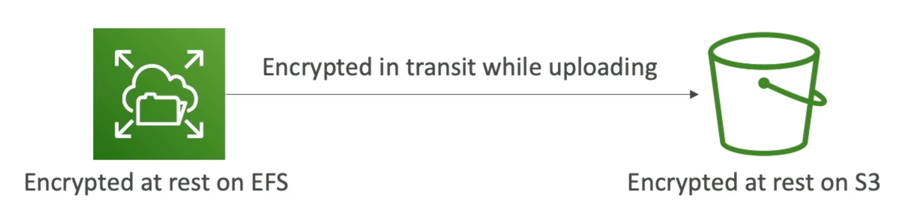

# 休息时间数据与过境数据

- 实时：存储或存档在设备上的数据
- 在硬盘上，在RDS实例上，在S3冰川深层档案中等。
- 过境（动议）：数据从一个地点转移到另一个地点
- 从房间传输到 AWS, EC2 传输到 DynamoDB 等
- 指网络上传输的数据
- 我们想要在两个州加密数据以保护它！
- 为此，我们可以通过加密密钥

# KMS (密钥管理服务)

- 随时您听到AWS服务的"加密"，它最有可能的 KMS
- KMS = AWS 管理我们的加密密钥
- 加密选项：
  - EBS卷：加密卷
  - S3 buckets: 服务器端的对象加密 (SSE-S3 默认启用, SSE-KMS 选择in)
  - Redshifting 数据库：数据加密
  - RDS数据库：数据加密
  - EFS 驱动器：数据加密
- 自动加密启用：
  - 云轨迹日志
  - S3 冰川：
  - 存储网关

# CloudHSM (硬件安全模块)

- KMS => AWS 管理加密软件
- CloudHSM => AWS 规定加密硬件
- 专用硬件(HSM = 硬件安全模块)
- 您完全管理您自己的加密密钥(不是 AWS)
- HSM 设备抗性强，FIPS 140-2

# KMS 密钥类型

## 客户管理密钥：

- 创建、管理和使用客户，可以启用或禁用
- 旋转政策的可能性(每年生成的新密钥，旧密钥保全)
- 使用您自己的密钥的可能性

## AWS 管理密钥：

- AWS代表客户创建、管理和使用
- AWS 服务 (aws/s3, aws/ebs, aws/redshift)

## AWS 拥有密钥：

- AWS服务所拥有的 CMK 集合并设法在多个帐户中使用
- AWS 可以使用这些来保护您帐户中的资源 (但您不能查看密钥)

## CloudHSM 密钥(自定义密钥存储)：

- 从您自己的 CloudHSM 硬件设备生成的密钥
- 加密操作是在云端HSM集群内执行
