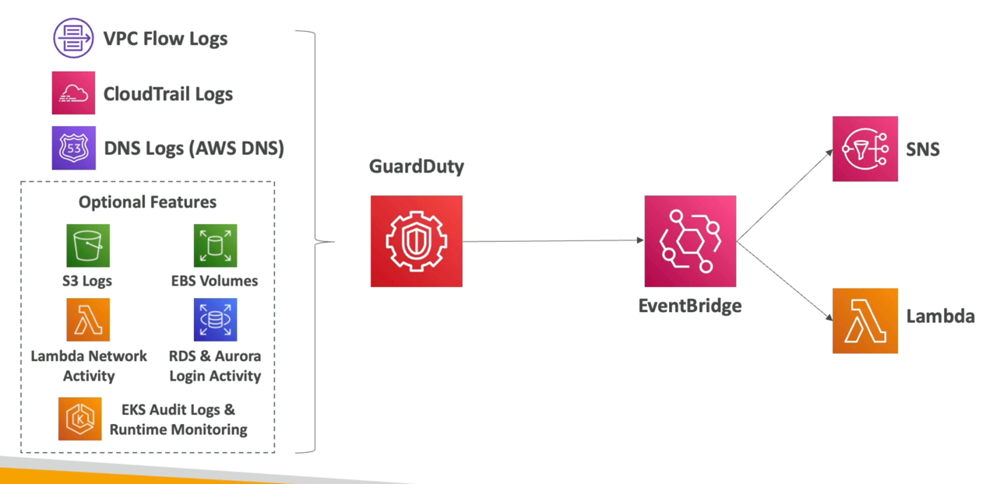

# 守卫者

- 智能威胁发现以保护您的 AWS 帐户
- 使用机器学习算法，异常检测，第三方数据
- 一次点击启用 (30天试用) ，无需安装软件
- 输入数据包括：
  - CloudTrail Events 日志 - 异常的 APl 调用，未经授权的部署
    - CloudTrail 管理事件 - 创建 VPC 子网，创建轨迹...
    - CloudTrail S3 数据事件 - 获取对象，列表对象，删除对象...
  - VPC 流日志 - 不寻常的内部流量、 不寻常的 IP 地址
  - DNS 日志 - 已破坏的 EC2 实例在 DNS 查询中发送编码数据
  - 可选功能 - EKS Audit Logs, RDS & Aurora, EBS, Lambda, S3 数据事件...
- 可以设置 EventBridge 规则在发现情况下被通知
- EventBridge 规则可以针对AWS Lambda 或 SNS
- 可以保护您免受Crypto Crypto Currency attacks (有专门的“finding”)
