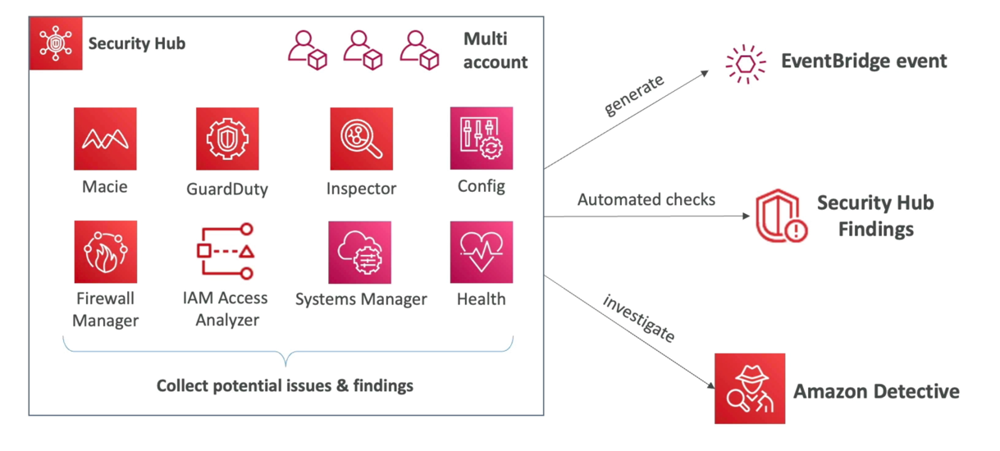

# AWS 安全中心

- 中央安全工具，用于管理几个AWS账户的安全并使安全检查自动化
- 集成仪表板显示当前的安全和合规状态以快速采取动作
  AWs 服务 & 作为耳机可以通过各种
  合作伙伴工具来共享已定义或个人调研结果格式：
  - 配置
  - 守卫者
  - 检查员
  - Macie
  - IAM 访问分析器
  - AWS 系统管理器
  - AWS 防火墙管理器
  - AWS 健康
  - AWS 合作伙伴网络解决办法
- 必须首先启用 AWS 配置服务
