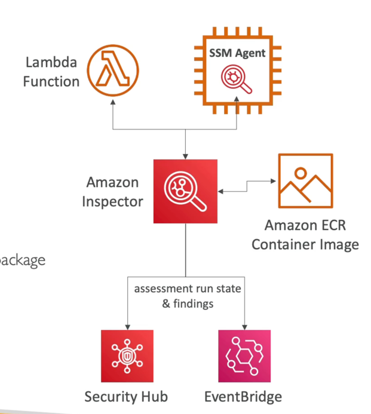

# 检查员

- 自动安全评估
- EC2 实例
  - 利用AWS系统管理器 (SSM) 代理
  - 分析意外的网络访问权限
  - 根据已知的脆弱性分析运行的操作系统
- 容器图像推送到Amazon ECR
  - 容器图像被推送时的评估
- Lambda 函数
  - 在函数代码和软件包依赖中识别软件脆弱性
  - A. 对部署的职能的评估
- 报告和整合AWS Security Hub
- 向亚马逊事件桥发送结果

# 什么是检查员？

- 记住：仅用于 EC2 实例， 容器图像和 Lambda 功能
- 仅在需要时连续扫描基础设施
- 软件包脆弱性(EC2, ECR & Lambda) - CVE 数据库
- 网络可达性 (EC2)
- 风险分数与优先级的所有脆弱性相关联。
