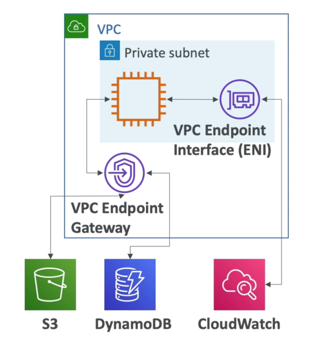
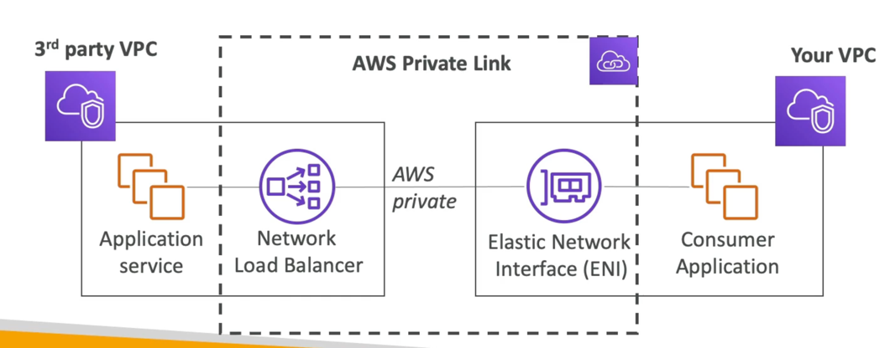

# VPC Endpoint

- 端点允许您使用私有网络而不是公共的 www 网络连接到 AWS 服务
- 这会提高您的安全性并降低访问AWS服务的延迟
- VPC Endpoint Gateway: S3 & DynamoDB
- VPC Endpoint Interface: the rest
  

# 私有链接

- 最安全和可缩放的方式将服务曝光到1000s of VPCs
- 不需要 VPC 节点，互联网网关，NAT，路由表...
- 需要网络负载均衡器 (Service VPC) 和 ENI (Customer VPC)
