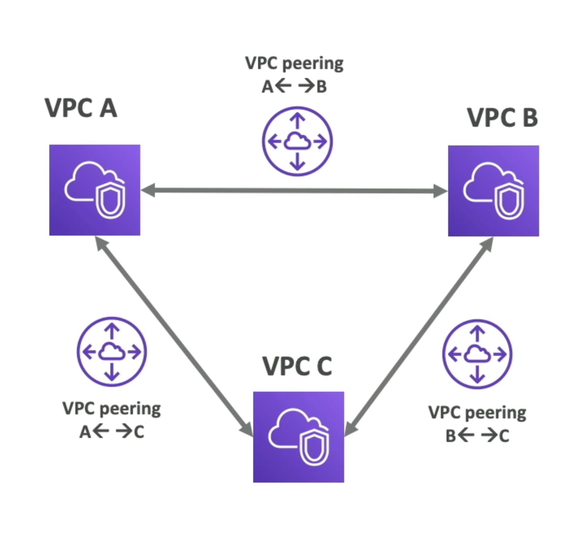

# VPC 流日志

- 捕获到您的接口中的 IP 流量信息：
  - VPC 流日志
  - 子网流日志
  - 弹性网络界面流日志
- 帮助监视和故障排除连接问题。 示例：
  - 网络子网
  - 子网到子网
  - 子网的网络
- 从 AWS 管理接口获取网络信息：Elastic
  负载均衡器、ElastiCache、RDS、Aurora 等...
- VPC 流日志数据可以到 S3, CloudWatch 日志和 Amazon 数据烟花数据

# VPC Peering

- 使用AWS网络私下连接两个虚拟机
- 让他们的行为仿佛是在同一个网络
- 必须没有重叠的 CIDR (IP 地址范围)
- VPC Peering 连接不是临时性的(必须为每个VPC 建立，需要彼此通信)
