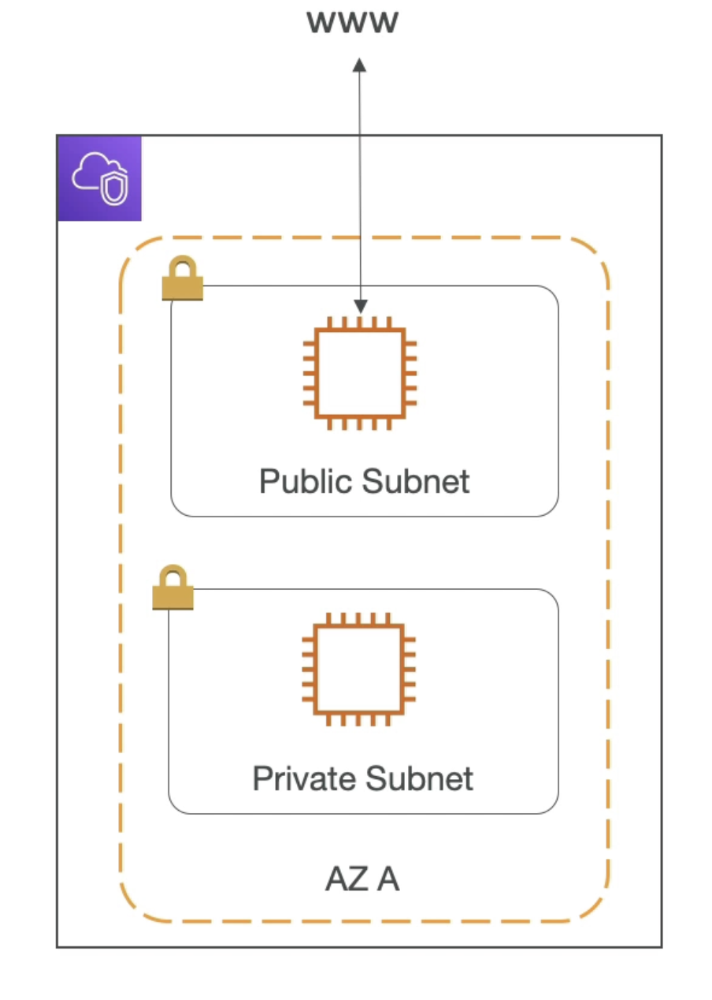
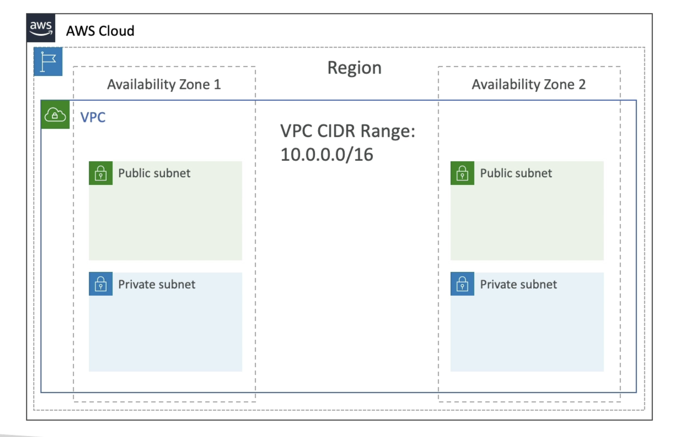
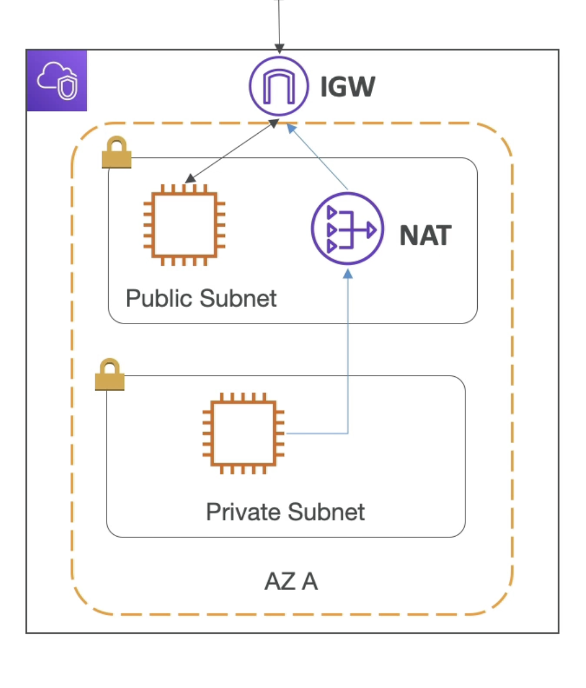

# VPC (虚拟隐私云)

- VPC - 虚拟隐私云：部署资源的私人网络 (区域资源)
- 子网允许您在 VPC 内分区您的网络 (可用区域资源)
- 公共子网是可从互联网上访问的子网
- 私有子网是无法从互联网上访问的子网
- 要定义网络连接和子网之间的连接，我们使用路由表。

# 图表

# 互联网网关和NAT 网关

- 互联网网关帮助我们的 VPC 实例与互联网连接
- 公共子网有一条通往互联网网关的道路。
- NAT 网关(AWS-managed) & NAT 实例(自管理) 允许您的私密子网中的实例访问互联网，同时保持私有状态
