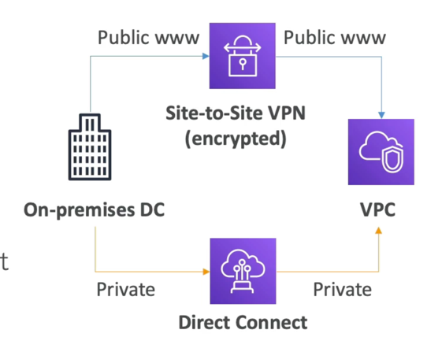
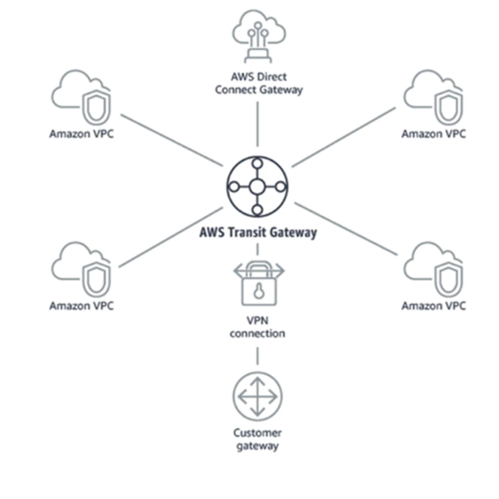

# 站点到站点VPN vs. 直接连接

## 站点到站点 VPN

- 前提：必须使用客户网关 (CGW)
- AWS: must use a Virtual Private Gateway
  VGW
  
- 将一个在前提上的 VPN 连接到 AWS Public www
- 连接自动加密
- 通过公共互联网访问

## 直接连接

- 在办公地点与AWS之间建立实际联系
- 连接是私密、安全和快速的
- 去私人网络
- 至少需要一个月的时间来确定

# Client VPN

- 使用 OpenVPN 从您的电脑连接到您在 AWS 中和房地上的私人网络
- 允许您通过私有IP连接到您的 EC2 实例 (就像您在私有VPC 网络中的情况)
- 通过公共互联网访问

# 中转网关

- 因为数以千计的虚拟机与场地之间有过渡性的连接，中心和语音（星）连接
- 提供此功能的单个网关
- 直接连接网关，VPN 连接
